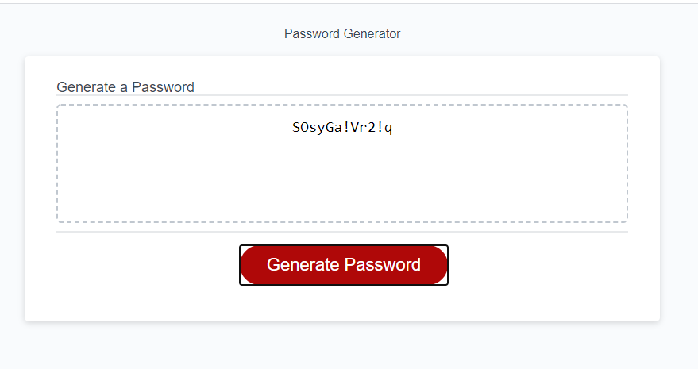

# passwordGenerator
Created by: Tori Sanford
Date: 01/04/2020 
Contact: Tori.danielle.clark91@gmail.com
Link to deployed project: https://tsanfordgatech.github.io/passwordGenerator/
Screen shot of completed assignment:  (copied from my previous read me. Input screenshot at end)

About this Project: 
This project is my CSS/bootstrap homework assignment. My objective is to create an application that an employee can use to generate a random password based off a specific criteria outlined in my read me and html. 

What I learned from this project: 
- better use of variables 
- how to properly use and call an array
- proper usage of an event listener 

This is the user story: 
AS AN employee with access to sensitive data
I WANT to randomly generate a password that meets certain criteria
SO THAT I can create a strong password that provides greater security

Acceptance Criteria: 
GIVEN I need a new, secure password
WHEN I click the button to generate a password
THEN I am presented with a series of prompts for password criteria
WHEN prompted for password criteria
THEN I select which criteria to include in the password
WHEN prompted for the length of the password
THEN I choose a length of at least 8 characters and no more than 128 characters
WHEN prompted for character types to include in the password
THEN I choose lowercase, uppercase, numeric, and/or special characters
WHEN I answer each prompt
THEN my input should be validated and at least one character type should be selected
WHEN all prompts are answered
THEN a password is generated that matches the selected criteria
WHEN the password is generated
THEN the password is either displayed in an alert or written to the page

These are the grading requirements and my objectives: 
Grading Requirements
This homework is graded based on the following criteria:

Technical Acceptance Criteria: 40%

Satisfies all of the above acceptance criteria plus the following:

The homework should not produce any errors in the console when you inspect it using Chrome DevTools.

Deployment: 32%

Application deployed at live URL.

Application loads with no errors.

Application GitHub URL submitted.

GitHub repository that contains application code.

Application Quality: 15%

Application user experience is intuitive and easy to navigate.

Application user interface style is clean and polished.

Application resembles the mock-up functionality provided in the homework instructions.

Repository Quality: 13%

Repository has a unique name.

Repository follows best practices for file structure and naming conventions.

Repository follows best practices for class/id naming conventions, indentation, quality comments, etc.

Repository contains multiple descriptive commit messages.

Repository contains quality README file with description, screenshot, and link to deployed application.

Review
You are required to submit the following for review:

The URL of the deployed application.

The URL of the GitHub repository. Give the repository a unique name and include a README describing the project.

